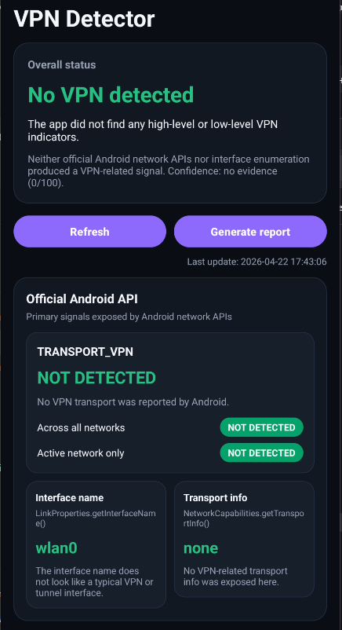
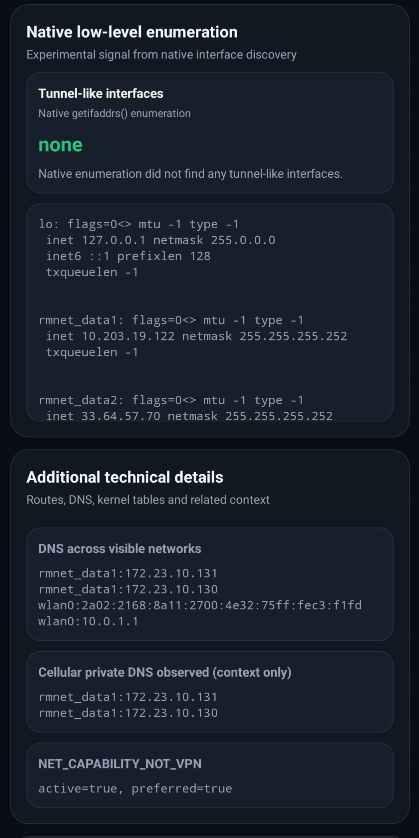
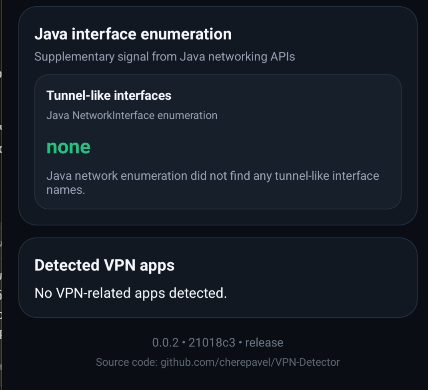

# RouteKit

**Русский** | [English](README.en.md)

RouteKit - root-инструмент для Android, который помогает настраивать выборочную маршрутизацию сервисов без системного Android VPN.

Проект объединяет Magisk/KernelSU-модуль, Android-приложение, `sing-box`, zapret/nfqws и transparent proxy-правила. Для каждого сервиса можно выбрать один из режимов:

- `VPN` - направлять выбранные IPv4-адреса сервиса через активный VLESS-профиль с помощью transparent proxy.
- `zapret` - применять zapret/nfqws-стратегии для выбранного сервиса.
- `direct` - явно отправлять домены напрямую, без proxy/zapret.

Проект находится в beta-статусе и предназначен для rooted Android-устройств.

## Что Важно

- RouteKit не использует Android `VpnService`.
- RouteKit не создаёт типичный пользовательский TUN-интерфейс вроде `tun0`.
- Маршрутизация работает через root-правила `iptables`, DNS redirect, локальный `sing-box` listener и сервисные IP-списки.
- В проверенном сценарии RouteKit не был обнаружен стандартными VPN-индикаторами Android API и интерфейсной эвристикой.

Это не обещание “невозможно обнаружить вообще”. Приложения могут использовать собственные эвристики, проверять сеть, DNS, задержки, IP-адрес выхода или поведение конкретного сервиса. Но RouteKit не выглядит как обычный Android VPN-клиент, потому что не поднимает системный VPN transport.

## Проверка Обнаружения

Для проверки использовалось приложение [VPN Detector](https://github.com/cherepavel/VPN-Detector).

Результат теста: `No VPN detected`. Android API не сообщил `TRANSPORT_VPN`, Java/native enumeration не нашли tunnel-like интерфейсы.

<p align="center">
  
  
  
</p>

Технически это объясняется тем, что RouteKit работает не как Android VPN:

- нет `VpnService` и системного `TRANSPORT_VPN`;
- нет TUN-интерфейса, который обычно виден как `tun0`, `ppp*`, `wg*` или похожий tunnel-like interface;
- TCP-трафик выбранных сервисов перенаправляется root-правилами на локальный `sing-box`;
- DNS можно перенаправлять на локальный listener `127.0.0.1:1053`;
- IPv6 лучше блокировать, если используется IPv4-only transparent proxy, чтобы трафик не обходил правила.

## Возможности

- Android UI для управления сервисами, режимами, custom services и VLESS-профилями.
- Группы VPN-профилей с проверкой ping и сортировкой.
- Домены сервисов с поддержкой `suffix:` для wildcard-style записей.
- Автоматический сбор IPv4/IPv6 для VPN-mode сервисов.
- DNS redirect на локальный `sing-box` DNS listener.
- Transparent proxy для выбранных IPv4-направлений.
- IPv6 block для сценариев, где IPv6 может обойти IPv4-only transproxy.
- Диагностика и repair-действия для сервисов.
- Диагностика VPN-профилей.
- Импорт/экспорт custom services.
- Импорт VLESS из ссылки, текста или файла.
- Проверка обновлений через GitHub Releases.
- Magisk update metadata через `updateJson`.

## Скачать

APK и module zip доступны в последнем GitHub Release:

<https://github.com/Prost0Lime/RouteKit/releases/latest>

Для `v0.9.0+` Android package id: `io.github.prost0lime.routekit`.

Старые beta-сборки использовали `com.example.zapret2manager`, поэтому перед установкой `v0.9.0+` лучше удалить старое приложение, если Android показывает два RouteKit/Zapret manager приложения.

## Требования

- Rooted Android-устройство.
- Magisk, KernelSU или совместимая module-среда.
- Android 7.0+ для manager app.
- Рабочий VLESS-профиль для режима `VPN`.

## Типичный Сценарий

1. Установить root-модуль.
2. Установить/open Android-приложение RouteKit.
3. Импортировать один или несколько VLESS-профилей.
4. Выбрать активный VPN-профиль.
5. Создать или изменить сервис.
6. Выбрать режим сервиса: `VPN`, `zapret` или `direct`.
7. Нажать `Применить`.
8. Если что-то не работает, открыть диагностику сервиса.

Для wildcard-style доменов используйте:

```text
suffix:example.com
```

Это покрывает `example.com` и поддомены, которые попадают в логику маршрутизации/резолва.

## Скриншоты RouteKit

Скриншоты интерфейса будут добавлены отдельно. Лучше всего подготовить такие экраны:

- главный экран со статусом модуля и блоком обновлений;
- раскрытый блок VPN-профилей с группой, ping и активным профилем;
- список сервисов с разными режимами `VPN`, `zapret`, `direct`;
- окно настройки сервиса с доменами и режимом;
- окно диагностики сервиса со статусом `OK`;
- экран Magisk/KernelSU с модулем RouteKit и кнопкой обновления, если она отображается.

## Сборка APK

Проект использует Android Gradle Plugin 8.5.2 и Kotlin 1.9.24.

Для быстрой локальной проверки без release-keystore:

```bash
gradle :app:assembleDebug
```

Release APK:

```bash
gradle :app:assembleRelease
```

Если позже будет добавлен Gradle wrapper:

```bash
./gradlew :app:assembleRelease
```

Release signing настраивается через переменные окружения:

```text
ROUTEKIT_KEYSTORE_PATH
ROUTEKIT_KEYSTORE_PASSWORD
ROUTEKIT_KEY_ALIAS
ROUTEKIT_KEY_PASSWORD
```

## Сборка Module Zip

Windows PowerShell:

```powershell
powershell -ExecutionPolicy Bypass -File tools/package-module.ps1
```

Linux/macOS/WSL:

```bash
sh tools/package-module.sh
```

Zip будет создан в `dist/`.

Скрипты упаковки исключают runtime state, logs, generated `proxy.json`, `active_profile.txt` и пользовательские VPN-профили.

## Релизы

Релизы собираются через GitHub Actions при push тега:

```bash
git tag v0.9.0
git push origin v0.9.0
```

Workflow собирает APK, module zip и прикладывает их к GitHub Release.

См. [docs/RELEASE.md](docs/RELEASE.md) и [CHANGELOG.md](CHANGELOG.md).

Magisk update metadata публикуется через [update.json](update.json). Module id остаётся `zapret2_manager` для совместимости.

## Структура Проекта

```text
app/                     Android manager app
module/                  Root module payload
module/files/scripts/    Android shell control scripts
module/files/bin/        Bundled native binaries and zapret payloads
tools/dnsresolve/        Helper resolver source/build scripts
```

Основные пути на устройстве:

```text
/data/adb/modules/zapret2_manager/files
/data/adb/modules/zapret2_manager/files/scripts
/data/adb/modules/zapret2_manager/files/runtime
```

Module id всё ещё `zapret2_manager`, чтобы не ломать существующие пути, скрипты и совместимость обновления модуля.

## Безопасность

- Не коммитьте реальные VPN-профили, UUID, private keys или generated runtime configs.
- `module/files/config/profiles/`, `proxy.json`, `active_profile.txt` и runtime logs намеренно игнорируются git.
- Transparent proxy сейчас IPv4-focused. IPv6 entries определяются, но для IPv4-only transproxy рекомендуется держать IPv6 block включённым.
- Большие native binaries сейчас лежат прямо в репозитории. GitHub может предупреждать о `sing-box` больше 50 MB. Позже можно вынести binaries в Git LFS или release assets.

## Статус

RouteKit - active beta. Основные сценарии уже работают, но API, shell scripts и UI ещё могут меняться.
